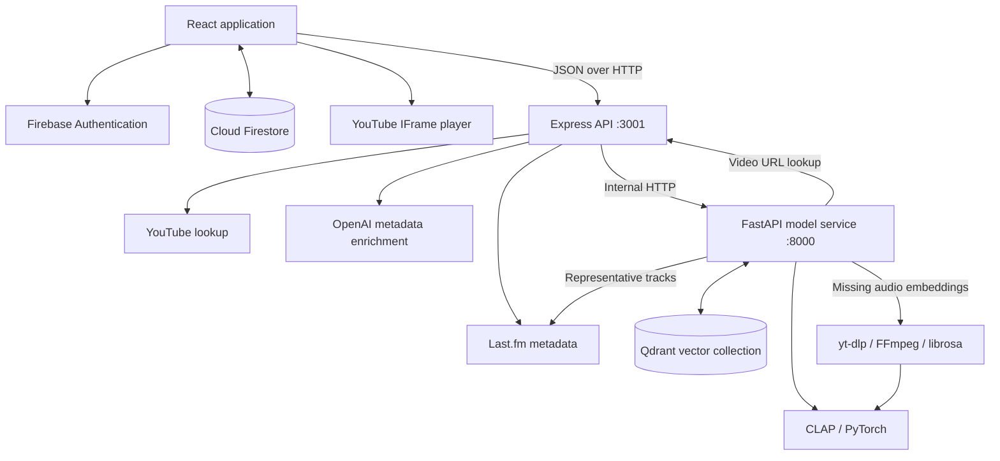
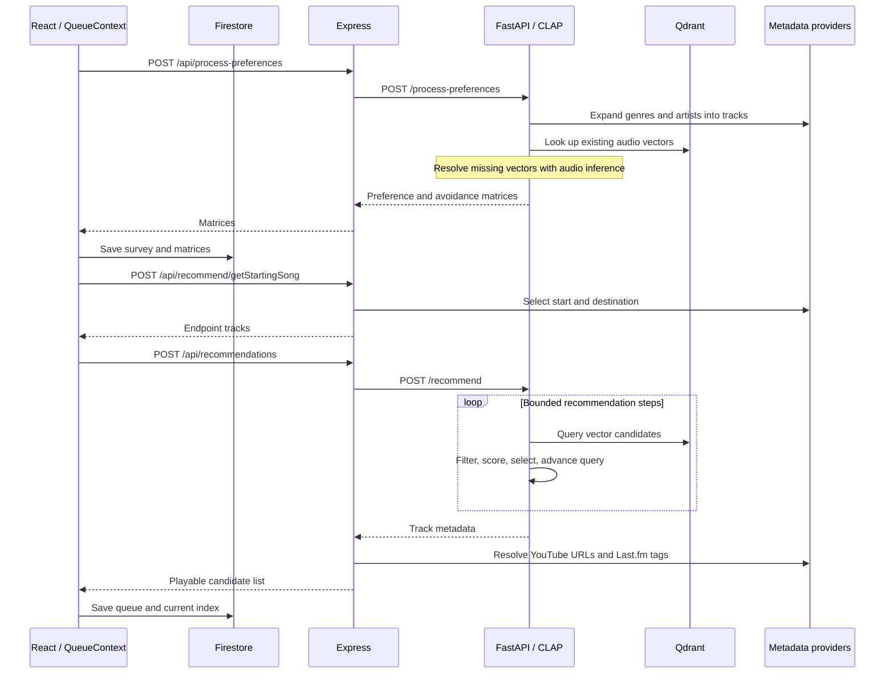

# Scramblr

Scramblr is a music discovery application that builds a path from familiar music toward a different destination. A listener supplies favorite songs, artists, and genres, chooses a discovery pace, and shapes later recommendations through likes and dislikes. Playback, listening history, and saved start-to-end playlists share the same account.

The recommendation engine combines CLAP audio embeddings, Qdrant vector retrieval, and explicit scoring for continuity, preferences, and avoidance. React handles the listening experience; Express coordinates metadata and recommendation requests; a persistent Python service runs model inference.

## Contents

- [Features](#features)
- [Architecture](#architecture)
- [Recommendation design](#recommendation-design)
- [State and persistence](#state-and-persistence)
- [API](#api)
- [Local development](#local-development)
- [Verification](#verification)
- [Deployment considerations](#deployment-considerations)
- [Repository map](#repository-map)
- [Credits](#credits)
- [Research foundations](#research-foundations)

## Features

- Email/password authentication and password reset through Firebase Authentication.
- A taste survey with song, artist, genre, and avoided-genre search.
- Continuous discovery with slow, regular, and quick recommendation batches.
- YouTube playback with queue navigation, reactions, and listening activity.
- Saved playlists containing a selected start track, ten generated bridge tracks, and a selected end track.
- Persistent preferences, playback position, listening history, and playlist management through Firestore.

## Architecture



### Components and boundaries

| Component | Responsibility | Main entry point |
| --- | --- | --- |
| React 19, React Router 7, Vite 7 | Routes, survey, queue coordination, player controls, account state | [`frontend/src/App.jsx`](frontend/src/App.jsx) |
| Express 4 on Node.js | Validate selected inputs, normalize payloads, call the model service, enrich results with metadata and playback URLs | [`backend/src/server.js`](backend/src/server.js) |
| FastAPI, NumPy, PyTorch, Transformers | Hold CLAP resources in memory, construct taste matrices, score candidates, resolve endpoints, apply reaction deltas | [`backend/src/model_service.py`](backend/src/model_service.py) |
| Qdrant | Retrieve stored audio vectors and song payloads; accept newly resolved vectors | [`backend/recommendation_algorithm/recommend.py`](backend/recommendation_algorithm/recommend.py) |
| Firebase Authentication / Firestore | Account identity and browser-managed persistent user data | [`frontend/src/firebase.js`](frontend/src/firebase.js), [`frontend/src/userFunctions.js`](frontend/src/userFunctions.js) |
| Provider adapters | Last.fm search/tags, YouTube URL lookup, OpenAI genre labels and artist biographies | [`backend/src/apis/`](backend/src/apis/) |

The browser talks directly to Firebase for authentication and persistence. Express does not own a user database or authenticate requests with Firebase tokens. The Python service is a long-running HTTP process, not a subprocess started for each recommendation. During startup it loads `laion/larger_clap_music`, selects CUDA when available and CPU otherwise, and creates a Qdrant client.

Playback streams through YouTube's browser player. Separately, missing embeddings can trigger server-side audio acquisition and inference. These are different paths: the model's temporary audio files are not the browser's playback source.

### Request lifecycle



The initial start is sampled from top tracks for preferred artists and genres. The destination is sampled from an allowed Last.fm top tag. On queue continuation, the last queued song becomes the next starting point. Endpoint selection and provider results introduce randomness; the application does not expose a deterministic seed contract.

## Recommendation design

### Audio embeddings and taste matrices

CLAP supplies 512-dimensional audio vectors. Existing Qdrant records are reused when a track can be matched. On a miss, the resolver can obtain a YouTube URL, download and convert audio with `yt-dlp` and FFmpeg, process it with librosa, compute an embedding, and write the result to Qdrant. The model weights are pretrained; this application performs inference and retrieval rather than training CLAP on each user's listening history.

The preference service expands each liked genre into up to five representative tracks and each liked artist into up to three. Avoided genres similarly provide representative tracks for an avoidance matrix. The HTTP service currently requires all four survey groups—genres, artists, songs, and avoided genres—to be nonempty.

Preferences are represented as matrices with shape `512 × n`, allowing multiple taste directions instead of one average vector. Similar vectors update an existing column; sufficiently different ones add a column. Initial construction uses a cosine-similarity threshold of `0.95`; feedback updates use the absolute cosine similarity when matching a delta to an existing column. This preserves distinct directions, but column count can grow as feedback accumulates.

### Candidate scoring and progression

Each step queries Qdrant near the current query vector and ranks eligible candidates. With the values supplied by the HTTP model service, the score is:

```text
query      = Qdrant similarity score
continuity = cosine(candidate, previous selected track)
liked      = max(0, maximum cosine against preference columns)
avoided    = max(0, maximum cosine against avoidance columns)

score = (0.55 × query + 0.35 × continuity) / 0.90
        + 0.60 × liked
        - 0.60 × avoided
```

The current service uses the `legacy` progression mode. After selecting vector `v`, it adjusts the destination using the most similar preference and avoidance columns, then advances the next query toward that adjusted destination:

```text
adjusted_destination = destination
                       + 0.60 × normalized_matching_preference
                       - 0.60 × normalized_matching_avoidance
next_query = v + 0.20 × (adjusted_destination - v)
```

Missing matching columns contribute no adjustment. The module also implements an interpolation mode, but the HTTP service selects `legacy`. Several standalone scripts have different defaults; [`model_service.py`](backend/src/model_service.py) is the source of truth for discovery parameters passed by the running HTTP service.

| Setting | HTTP discovery behavior |
| --- | --- |
| Slow / regular / quick | Up to 20 / 10 / 5 recommendation steps |
| Candidate search | Starts at 10 results, grows by 10; effective cap 150 with the service fallback limit |
| Score threshold | `0.0`; the bounded fallback may remove the score threshold |
| Continuity minimum | `0.0` cosine similarity |
| Hard avoidance-vector threshold | Disabled; vector avoidance contributes a score penalty |
| Track exclusions | Seen normalized title/artist pairs and explicitly avoided songs |
| Genre exclusions | Literal normalized tag matching, without a genre hierarchy |

The candidate count and search expansion are bounded. Generation can stop early if no candidate qualifies. Known avoided tags and songs are filtered again during Express enrichment. Missing genre tags remain unknown and do not prove that a track is outside an avoided genre. Metadata normalization also uses ASCII-oriented matching, so recording identity and non-Latin text require care.

### Feedback

A reaction transition produces deltas from the matched song vector:

```text
preference_delta = (is_like(next) - is_like(previous)) × song_vector
avoidance_delta  = (is_dislike(next) - is_dislike(previous)) × song_vector
```

For example, changing a like to a dislike subtracts its preference contribution and adds an avoidance contribution. Repeating the same reaction is a no-op; an unmatched song returns a missing-vector result. The browser requests matrix updates and persists the resulting matrices in Firestore. Future generation reads those preferences again. Playback counters and skips are stored as activity; the explicit like/dislike transition is the taste-vector update path.

### Start-to-end playlists

Playlist generation uses a separate interpolation chain. Ten interior query vectors are placed between the two endpoint vectors; candidate scoring combines query similarity with preference and avoidance signals. Endpoint identities and previously selected bridges are excluded during selection.

Express enriches the selected tracks and returns twelve entries: start, ten bridges, end. If an endpoint cannot be resolved to a playback URL, or fewer than ten bridges survive enrichment, the request fails instead of returning a shorter playlist. A found URL does not guarantee that YouTube will permit playback in every region or browser.

### Engineering tradeoffs

- **A persistent model process** avoids loading CLAP for every request. Each additional worker would hold its own model resources, so worker count affects memory consumption.
- **Vector retrieval plus explicit scoring** makes the continuity/taste tradeoff inspectable. Embedding similarity remains a proxy for perceived musical continuity, not a measured guarantee of recommendation quality.
- **Multiple taste columns** retain diverse preferences. They also increase payload size and persistence cost compared with a single vector.
- **Independent account and vector stores** separate user documents from the shared song collection. Browser-managed writes simplify the backend but do not provide an atomic transaction spanning queue, reactions, and inference.
- **Metadata enrichment after ranking** connects vector results to playable tracks. Provider latency, quotas, failed matches, and missing tags can shrink or invalidate a batch.

## State and persistence

Firestore paths used by the client:

```text
users/{uid}/
├── preferences/data
│   └── survey selections, pace, preference_matrix, avoid_matrix
├── queue/current
│   └── tracks, currentIndex, isGenerating, updatedAt
├── listening_history/{youtubeVideoId}
│   └── track metadata, reactions, play/skip/replay/completion counters, timestamps
└── playlists/{playlistId}
    ├── name, endpoints, deleted flag, timestamps
    └── queue/current
        └── tracks, currentIndex, isGenerating, updatedAt
```

Matrices are serialized as `{ data: [...], shape: [rows, columns] }` for Firestore and reconstructed into nested arrays at the application boundary. Playlist deletion is implemented with a `deleted` flag. Listening-history document identity uses the YouTube video ID, while recommendation matching primarily uses normalized title and artist values.

The Qdrant collection holds audio vectors and payload fields such as `song`/`title`, `artist`, `tags`, and `url`. Resolvers use text indexes on artist and song. Several insertion paths derive point IDs with UUIDv5 from a configured namespace and normalized artist/title. Keep that namespace stable for a given collection.

## API

The React application uses relative `/api` URLs. During development, Vite proxies those requests to `http://127.0.0.1:3001`. Express accepts JSON bodies up to `10mb`.

| Method | Route | Purpose |
| --- | --- | --- |
| GET | `/api/search/artist`, `/api/search/track`, `/api/search/album`, `/api/search/genre` | Search with `q`; nonempty query, maximum 200 characters |
| GET | `/api/genres` | Last.fm top tags |
| GET | `/api/search/youtubeURL` | Resolve `title` and `artist` to a video result |
| GET | `/api/track/genre` | Generate a genre label for `title` and `artist` |
| GET | `/api/artist/bio` | Generate a short biography for `artist` |
| POST | `/api/process-preferences` | Convert survey selections into preference/avoidance matrices |
| POST | `/api/recommend/getStartingSong` | Select initial start and destination tracks |
| POST | `/api/recommend/getNewEnd` | Select a new destination from a supplied current song |
| POST | `/api/recommendations` | Generate and enrich a discovery batch |
| POST | `/api/process-interaction-vector` | Compute deltas from previous/next reaction |
| POST | `/api/apply-delta-vector` | Apply one vector delta to a matrix |
| POST | `/api/playlists/generate` | Generate a playlist from `startSong` and `endSong` |

Discovery requests carry the survey selections, matrices, pace, endpoints, queue, and avoided songs. A returned track has this shape:

```json
{
  "title": "Track title",
  "artist": "Artist name",
  "genre": "Unknown",
  "youtubeUrl": "https://www.youtube.com/watch?v=VIDEO_ID"
}
```

Discovery returns a track array; playlist generation returns `{ "tracks": [...] }`. Errors generally use `{ "error": "..." }`, with route-specific `400`, `404`, `500`, or `502` responses. There is no versioned error-code contract.

The internal FastAPI endpoints are `/process-preferences`, `/recommend`, `/update-preferences`, `/apply-delta-vector`, and `/generate-playlist`. Keep that service reachable only by trusted application infrastructure.

## Local development

### Prerequisites

- Node.js 24 LTS and npm.
- Python with support for the source's Python 3.10+ syntax and compatible PyTorch, Transformers, and librosa packages.
- FFmpeg for resolving tracks that do not already have vectors.
- A Firebase project with email/password authentication, Firestore, and authorized development domains.
- A populated Qdrant collection containing compatible 512-dimensional song vectors.
- Last.fm and YouTube API credentials; an OpenAI key for the biography/genre panels.
- Network access for providers and the initial CLAP model download.

The repository does not include a Qdrant database export, model weights, Firebase security rules, or a fully provisioned cloud environment. The text inventories under `scraper/` are song lists, not a ready-to-query vector collection.

### Install

```bash
git clone https://github.com/wavepin/scramblr-lite.git
cd scramblr-lite
npm ci --prefix backend
npm ci --prefix frontend
python3 -m venv .venv
source .venv/bin/activate
python -m pip install --upgrade pip
python -m pip install -r backend/requirements.txt
cp backend/.env.example backend/.env
```

Python dependencies are unpinned. Use a separate virtual environment and record working versions for your deployment. Install FFmpeg with your platform's package manager.

### Configure

Fill in `backend/.env`:

| Variable | Purpose |
| --- | --- |
| `LASTFM_API_KEY` | Search, tags, and representative-track expansion |
| `YOUTUBE_API_KEY` | Video search through YouTube Data API |
| `QDRANT_API_KEY` | Read/write access to the configured collection |
| `QDRANT_COLLECTION_NAME` | Collection name; module fallback is `youtubeDataset` |
| `FFMPEG_PATH` | FFmpeg installation location used by audio conversion |
| `URL_BASE` | Express callback URL; use `http://localhost:3001/` locally |
| `OPENAI_API_KEY` | Generated genre labels and artist biographies |
| `MODEL_SERVICE_URL` | FastAPI base URL; use `http://127.0.0.1:8000` without a trailing slash |
| `UUID_NAMESPACE` | Valid, stable UUID string for deterministic point IDs |

Correct the double colon in the example's `MODEL_SERVICE_URL` when creating your local file. Generate a namespace once, if your collection does not already define one, with `python -c 'import uuid; print(uuid.uuid4())'`.

Qdrant URLs are currently constants in the Python modules, not an environment setting. For your own cluster, update the relevant `QDRANT_URL` constants under `backend/src/model_service.py` and `backend/recommendation_algorithm/`. Firebase requires your own API key and project configuration, just like the other services. Replace all six `YOUR_FIREBASE_*` placeholder strings in [`frontend/src/firebase.js`](frontend/src/firebase.js) with the `apiKey`, `authDomain`, `projectId`, `storageBucket`, `messagingSenderId`, and `appId` values from your Firebase project's web-app configuration. Enable email/password authentication, configure authorized development domains, and deploy Firestore rules that restrict access to each authenticated user's documents. No working Firebase configuration is included. Keep your configured values local and do not commit them. See [Firebase's configuration guidance](https://firebase.google.com/docs/projects/learn-more).

The playlist resolver also contains a fixed `http://localhost:3001/` callback URL. Account for it if changing the backend host or port.

### Run three processes

From the repository root, open separate terminals:

```bash
# Terminal 1: model service
source .venv/bin/activate
cd backend
python -m uvicorn src.model_service:app --host 127.0.0.1 --port 8000
```

```bash
# Terminal 2: Express
cd backend
npm start
```

```bash
# Terminal 3: React development server
cd frontend
npm run dev -- --host 127.0.0.1 --port 5173 --strictPort
```

Wait for model startup before submitting the survey, then open [localhost:5173](http://localhost:5173). The macOS helper starts Express and Vite only; run FastAPI separately. The Windows-oriented `run-local.sh` expects `node.exe`, `python.exe`, and PowerShell. Both helpers manage their development ports, so use the manual commands when other processes share those ports.

## Verification

```bash
npm test --prefix backend
npm run lint --prefix backend
npm run lint --prefix frontend
npm run build --prefix frontend
```

The backend uses Node's built-in test runner for provider adapters and API/helper behavior. Mocked requests cover validation, provider failures, matching, and recommendation exclusions. There is no frontend test script; lint and a Vite production build are the checked-in frontend checks.

The focused Python recommendation suite stubs model and database dependencies:

```bash
python -m pip install pytest numpy python-dotenv
python -m pytest backend/recommendation_algorithm/test_recommend.py -q
```

It checks query updates, matrix similarity, candidate ranking, exclusions, continuity, configured collection lookup, and failure handling. [`backend/recommendation_algorithm/test.py`](backend/recommendation_algorithm/test.py) is a separate live model/database experiment, not that unit suite. Unit-test success does not verify live provider configuration, YouTube playback, or subjective transition quality.

Verification: the Node suite passes 27 tests, the focused Python suite passes 14 tests, and the frontend production build succeeds. Lint currently reports two unused-variable errors in `backend/src/apis/musicbrainz.js` and two in `frontend/src/pages/Activity.jsx`. The production build also reports a JavaScript chunk above Vite's 500 kB warning threshold.

## Deployment considerations

The application consists of a built static frontend, one Express process, and a separate model process, with external Firebase and Qdrant services. `npm run build --prefix frontend` writes `frontend/dist`; serve it through an HTTP server with SPA fallback and forward `/api` to Express. Vite's development proxy is not part of the built site. No production reverse-proxy configuration or container deployment is included.

Relevant implementation limits:

- Express currently enables broad CORS and has no authentication middleware, rate limiter, or session ownership checks. Production exposure requires an access-control and request-budget design.
- The Express-to-model helper has no explicit request deadline. The extra timeout argument at the playlist call site is not consumed by that helper.
- Provider work runs during normal requests. The YouTube adapter includes an HTML-search fallback after API failure; its behavior depends on external markup and should be reviewed before deployment.
- OpenAI biographies and genre labels use `gpt-4o-mini` and process-local caches. Generated text is not verified music metadata, and cache contents disappear on restart.
- The model process can consume substantial memory and CPU; no deployment capacity benchmark is included. Multiple workers also interact with shared temporary-audio paths and require concurrency review.
- Browser-managed Firestore updates are not atomic across preference, reaction, and queue documents. Cloud rules and indexes must be provisioned separately.
- The playback loading animation contains simulated diagnostic output. It is presentation, not model telemetry.

For troubleshooting, a model connection error usually means FastAPI is absent or `MODEL_SERVICE_URL` is wrong. Vector lookup failures require checking the collection name, payload fields, and Qdrant permissions. Empty or rejected playlists can also result from video lookup failures or insufficient bridge candidates. Sign-in and persistence failures require checking Firebase configuration, authorized domains, and Firestore rules.

## Repository map

```text
backend/
├── src/
│   ├── server.js                    Express routes and provider orchestration
│   ├── model_service.py             Persistent FastAPI / CLAP service
│   └── apis/                        Metadata and video adapters
├── recommendation_algorithm/
│   ├── get_vector_from_preferences.py
│   ├── recommend.py                 Adaptive discovery chain
│   ├── recommend_playlist.py        Endpoint interpolation chain
│   ├── update_vector_from_interactions.py
│   ├── yt_download.py
│   └── test_recommend.py            Focused unit tests
├── test/                            Node test suites
├── requirements.txt
└── .env.example
frontend/
├── src/
│   ├── App.jsx                      Routes and context composition
│   ├── QueueContext.jsx             Queue restoration and generation
│   ├── userFunctions.js             Firestore access and matrix serialization
│   ├── firebase.js                  Firebase initialization
│   ├── pages/                       Account, survey, playback, activity, playlists
│   └── assets/                      Images and shared header
└── vite.config.js                   Development API proxy
scraper/                             Song inventories and Last.fm collection utility
run-local-mac.sh                     macOS frontend/backend helper
run-local.sh                         Windows-oriented three-process helper
```

## Credits

- [Jason Do](https://github.com/wavepin)
- [Bruce Do](https://github.com/Dos0n)
- [Theo Dor](https://github.com/TheoTheoTh)
- [Drew Marceau](https://github.com/drewcod)
- [Ceren Oguz](https://github.com/cerenoguz1)
- [Roshan Pillai](https://github.com/rp1lla1)
- [Noah Shayne](https://github.com/noahshayne)

## Research foundations

- Yusong Wu, Ke Chen, Tianyu Zhang, Yuchen Hui, Taylor Berg-Kirkpatrick, and Shlomo Dubnov. *Large-scale Contrastive Language-Audio Pretraining with Feature Fusion and Keyword-to-Caption Augmentation.* ICASSP, 2023.
- Ke Chen, Xingjian Du, Bilei Zhu, Zejun Ma, Taylor Berg-Kirkpatrick, and Shlomo Dubnov. *HTS-AT: A Hierarchical Token-Semantic Audio Transformer for Sound Classification and Detection.* ICASSP, 2022.

The deployed model identifier is `laion/larger_clap_music`; the application builds its retrieval and feedback logic around that pretrained representation.
